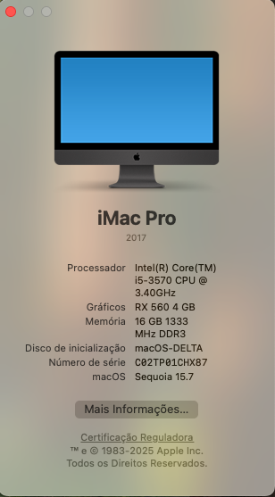

# 🍏 EFI – DELTA H61M2K – macOS Sequoia 15.7

<p align="center">
  
</p>


<p align="center">
  ⚙️ Um projeto experimental que virou lenda: o Delta H61M2K rodando macOS Sequoia como um verdadeiro iMac Pro.<br>
  Criado com 💡 criatividade, ♻️ reaproveitamento e ❤️ paixão pela tecnologia.
</p>

---

## 🧠 Especificações do Sistema

• **Placa-mãe:** DELTA H61M2K  
• **Chipset:** Intel H61 (Cougar Point PCH – B3)  
• **Processador:** Intel Core i5-3570 @ 3.40GHz (3ª geração Ivy Bridge)  
• **Placa de vídeo:** Gigabyte Radeon RX 560 4GB (Polaris 21 XT)  
• **Memória:** 16GB DDR3 1333 MHz  
• **Áudio:** Controlador Intel HD Audio (Cougar Point) via interface USB interna  
• **Rede:** Realtek PCIe GbE — desempenho incrível pra época  
• **Armazenamento 1:** NVMe HW com macOS Sequoia  
• **Armazenamento 2:** SSD Goline SATA com Windows 10  
• **Gabinete:** achado enferrujado no lixão, pintado de preto e revivido 😂  
• **Monitores:** Samsung + LG do lixão — R$100 o par e funcionando perfeito  
• **Teclado e Mouse:** já tinha por aqui  

> **Feito de restos, mas com coração de Mac. ❤️💻**

---

## 🍎 macOS

| Item | Detalhe |
|------|----------|
| **Versão** | macOS Sequoia 15.7 |
| **Bootloader** | OpenCore 1.0.5 |
| **SMBIOS** | iMacPro1,1 (genérica) |
| **Modo de Boot** | UEFI |
| **Aceleração Gráfica** | OK (RX 560 Polaris) |
| **Áudio / Rede / USB /** | 100% funcionais |
| **Dual Boot** | macOS Sequoia + Windows 10 |

---

## 🧩 Kexts Utilizadas

| Kext | Função | Repositório Oficial |
|------|--------|----------------------|
| [Lilu.kext](https://github.com/acidanthera/Lilu) | Framework principal |
| [WhateverGreen.kext](https://github.com/acidanthera/WhateverGreen) | GPU / gráficos AMD |
| [VirtualSMC.kext](https://github.com/acidanthera/VirtualSMC) | Emulação SMC |
| [AppleALC.kext](https://github.com/acidanthera/AppleALC) | Áudio (USB HD Audio) |
| [RealtekRTL8111.kext](https://github.com/Mieze/RTL8111_driver_for_OS_X) | Rede Realtek PCIe GbE |
| [NVMeFix.kext](https://github.com/acidanthera/NVMeFix) | Otimização de NVMe |
| [FeatureUnlock.kext](https://github.com/acidanthera/FeatureUnlock) | Sidecar e recursos extras |

---

## ⚙️ ACPI / SSDTs

• SSDT-EC  
• SSDT-PLUG  
• SSDT-USBX  
*(testados manualmente para energia e estabilidade)*

---

## 🧾 Boot-args Ativos

```
-v keepsyms=1 debug=0x100 agdpmod=pikera(Não é Obrigatorio para RX560)
```

---

## 🧠 Funcionalidades

✅ Aceleração gráfica completa (RX 560)  
✅ Áudio USB interno perfeito  
✅ Rede Realtek PCIe funcional nativamente  
✅ iCloud / FaceTime / iMessage funcionando  
✅ USBs mapeadas e energizadas corretamente  
✅ Dual Boot com Windows 10 (Goline SSD)  
✅ Sleep / Wake estáveis  
✅ Thaoe rodando liso! 🎶 (precida de uns ajustes na EFI) Usar MacPro7,1

---

## 📦 Drivers EFI/OC/Drivers

- OpenRuntime.efi  
- HfsPlus.efi  
- ResetNvramEntry.efi  
- OpenCanopy.efi  

---

## 🧰 Utilitários Usados

- **ProperTree** | (edição do config.plist) https://github.com/corpnewt/ProperTree |
- **GenSMBIOS** | (geração SMBIOS genérica)  https://github.com/corpnewt/GenSMBIOS |
- **MountEFI** | (montagem de partições EFI)  https://github.com/corpnewt/MountEFI |
---

## 💬 Créditos
Baseado no trabalho do time oficial **Acidanthera / OpenCore** ❤️  
Créditos especiais à comunidade **Hackintosh🇧🇷**  
Criado e documentado por **Dione Freire – D3Tecnologia**


---

<p align="center">
  🚀 "Feito de restos, mas com coração de Mac." ❤️💻  
  <br>
  <sub>© 2025 D3Tecnologia – Todos os direitos reservados.</sub>
</p>
